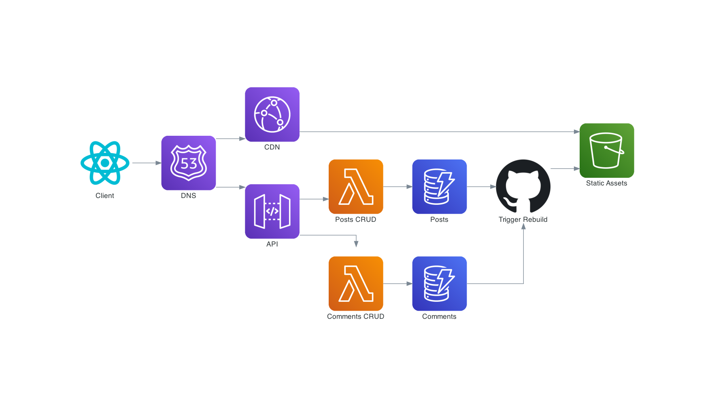

# www.benwainwright.me

This repository contains the source code for my personal website.
(https://www.benwainwright.me).

The site is a statically generated [Gatsby](https://www.gatsbyjs.com/) application written in TypeScript and hosted by AWS
S3. In order to keep the pages performant but provide myself with a simple
editing UI, I'm working towards an architecture where blog posts are generated
statically at build time including all of their content based on data from an API
The admin area doesn't need to be as fast, so it interfaces with the API directly.

At the time of writing, I've written the admin area and transferred all the posts in the database,
but I've not yet hooked the static page build up to that API. This is the architecture I'm working towards though:

