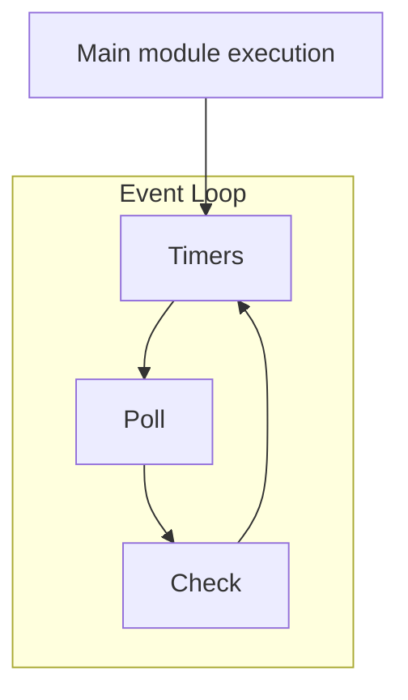

Given a function that is meant to make a http request after a short delay, how to do you write a test that verifies the length of the delay? Sounds like a straightforward problem, right?

This was the problem I was faced with when pairing with a colleague on a recent piece of work; we wanted to implement an 'exponential backoff' retry mechanism, and to verify that it worked. Turns out it isn't quite as easy as you think.


For the sake of this article, I've simplified the module under test to the following:

```JavaScript
const axios = require("axios")

const requestWithDelay = async () => 
await new Promise((accept) => {
  setTimeout(async () => {
    accept(await axios.get("http://www.google.com"))
  }, 2000)
});

module.exports = {
  requestWithDelay
}
```
## Waiting in real time

First let's consider the the behaviours we are interested in testing. They are:

* After 1 second, the promise is _not_ yet resolved
* After 2 seconds, the promise is resolved 

The very simplest way of achieving this would be to wait in _real time_, and then check if the promise has resolved or not.
```JavaScript
const { requestWithDelay } = require("./timers");
const axios = require("axios");

afterEach(() => jest.resetAllMocks())

jest.mock("axios");

test("it should have resolved after three seconds", (done) => {
  axios.get.mockReturnValue(Promise.resolve());

  let hasResolved = false;

  requestWithDelay().then(() => hasResolved = true);

  const delay = 3000
  
  setTimeout(() => {
    expect(hasResolved).toEqual(true);
    done();
  }, delay);
});
```

To test the 'does resolve' behaviour, simply change `delay` to `1000` (or any number less than `2000`), and flip the expectation to `false`.  You also need to move the `done()` callback into the `.then` closure above. Couple of things to note here:

* I can't use `async/await` for this test because I'm *specifically* interested in the promise resolution behaviour; I need test logic to execute *before* the promise resolves
* Since I'm not awaiting the promise, I need to use the `done()` callback to explicitly tell jest that the test is complete when the promise resolves.

This approach _does work_ (if you copy my code, you will see that the tests pass) but it's not ideal; waiting in real time introduces *real delays* to each test. Unit tests are about *fast feedback*; if the delays were longer and there were many more tests you can quickly see this test suite becoming sluggish.

## Jest Fake Timers

In order to test delays without  using up precious seconds in our test, the normal approach is to use jest's "fake timers" feature. This mocks out core node functions that are used to introduce delays and allows you to manually change the time. We can demonstrate it with a simple test

```JavaScript
test("timer works", () => {
  jest.useFakeTimers()

  let timeoutHasHappened = false

  setTimeout(() => timeoutHasHappened = true, 1000)

  jest.advanceTimersByTime(500)
  expect(timeoutHasHappened).toEqual(false)

  jest.advanceTimersByTime(500)
  expect(timeoutHasHappened).toEqual(true)

  jest.useRealTimers()
})
```

This looks useful, so let's try to rewrite our original test

```JavaScript
const { requestWithDelay } = require("./timers");
const axios = require("axios");

jest.mock("axios");

afterEach(() => {
  jest.resetAllMocks()
  jest.useRealTimers()
})

test("it should have resolved after three seconds", (done) => {
  jest.useFakeTimers()
  axios.get.mockReturnValue(Promise.resolve());

  let hasResolved = false;

  requestWithDelay().then(() => {
    hasResolved = true;
    done()
  });

  jest.advanceTimersByTime(3000)

  expect(hasResolved).toEqual(false);
});
```

If you run this test, you'll see that the test fails

```
Expected: true
Received: false
```

To understand why this doesn't work, we need to dig a little deeper into the underlying mechanics of the node event loop.

## Understanding the Event Loop

The NodeJS runtime is _single threaded_. I/O APIs provided by Node do not block that thread because

* The operation is handed off to the kernel
* When the operation completes, it is added to the NodeJS **poll queue**
* Events added to the poll queue are then processed in a synchronous manner once the current operation is completed and the runtime reaches the appropriate phase in the **event loop**

There are quite a few fairly detailed write-ups of how the event loop works available so I won't go into lots of detail here, but massively simplified (there are more phases than this), it looks like this



Each stage maintains a queue of **tasks**. When the main module is executed, if it makes any asynchronous calls, these will be handed off to the kernel as described above. When they complete, a callback will be added to one of the various **task queues** depending on what type of call it is.

* calls to `setImmediate()` will add a task to the task queue processed during the **check phase**
* calls to `setTimeout()` and `setInterval()` will add a task to the task queue processed during the **timers phase** once the specified interval has elapsed
* callbacks passed into other asynchronous operations (not including promise callbacks) will be executed during the **poll phase**

Each phase has slightly different behaviours associated with how it processes its queue, and when it proceeds to the next stage. A detailed description of those behaviours is out of scope for this article; however what's important to know is that
 before the event loop proceeds from one stage to the next, a call is made to a function that amongst other things, executes all of the callbacks that have been added to a separate queue, known as the **microtask queue**.  This is where Promise callbacks live.

## Back to our example

Now that we understand the event loop a little bit better, lets walk through our first test (waiting in realtime) and dissect how it fits in to what we just learned. Here are the important things that happen

### Main module execution

When our test module is executed, this is what happens

* `axios.get()` is replaced with a mock function that returns `Promise.resolve()`, which returns a promise that resolves immediately
* `requestWithDelay()` is called. This constructs a `Promise` object that contains a call to `setTimeout`, which we now know will push a callback onto the `timers` **task queue** to be executed in *two seconds*. The promise is then immediately returned
* inside the test, a callback is passed into the promise's `.then()` method
* we then call `setTimeout()` with another callback, this time to be executed in *three seconds*
* the test module has now finished executing. Since we've passed in the `done()` callback but not used it yet, `jest` knows that the test isn't *really* done, so waits for something to happen

### Event Loop

Now that the main module has finished executing, 

* Are there any active handles or requests? There are because the `setTimeout` callbacks have not been dealt with, so continue looping
* The first step in the event loop is the timers stage
* Since no timers have yet hit their timeout, Node checks the empty microtask queue and then proceeds to the next stage. 
* There is nothing in the poll stage, so the event loop waits for a predefined timeout and then checks the empty microtask queue and proceeds back to the timers stage

The above loop continues until two seconds has elapsed. Then this happens

* ... *and proceeds back to the timers stage*
* The `setTimeout` callback from the original function under test has now hit its timeout. Node executes that callback
* The callback executes `axios.get()` which returns an immediately resolving promise. Resolving this promise results in the `accept()` callback being called which resolves the promise at the top level of our function
* Since the promise resolved from the function under test is now resolved, the `.then` callback gets added to the microtask queue
* Node checks to see if there are any more timers that need to be executed. Since there are not it checks the microtask queue. Since it is no longer empty it executes the callback, which sets a variable captured from the enclosing scope (`hasResolved`) to true.
* When there no more callbacks in the microtask queue, node proceeds to the polling stage
* There is nothing in the poll stage, so the event loop waits for a predefined timeout and then checks the empty microtask queue and proceeds back to the timers stage
* Since there are no timers left that have hit their timeout, Node checks the empty microtask queue and then proceeds to the next stage.

Node then continues to pass through the event loop. There is nothing to do, but since there is still a `setTimeout` handle that hasn't been executed, the loop remains alive. When three seconds elapses, the loop behaviour is as follows

* ... *and proceeds back to the timers stage*
* The `setTimeout` callback from the test has now reached its timeout. Node executes the provide callback
* An assertion that `hasResolved` is now true executes - it is, so the test proceeds
* The `done()` callback is executed which lets `jest` know that the test has finished


At this point, there is one more pass through the poll and check phases. It then checks if there any active handles or requests; since there aren't (both `setTimeout` callbacks are are now dealt with), the loop ends and so the process is allowed to complete.

## What about the fake timers?

So how can we use this to understand our fake timers example. Well, the key takeaway is that timers are by default *asynchronous* and execute *after the currently executing context*. What is also useful to know is that Jest fake timers are currently implemented under the hood using [@sinonjs/fake-timers](https://github.com/sinonjs/fake-timers), which mocks out timer functions with *synchronous* equivalents, and provides no such replacement for Promises. Let's dissect our second example to try to understand the implications of this implementation. 

When the test module is executed

* `axios.get()` is mocked as before
* `requestWithDelay()`  is called. This constructs a  `Promise`  object that contains a call to  `setTimeout`. Since we are using fake timers, the callback gets added to the Sinon fake timers data structure instead of the node timers queue. The promise is again immediately returned
* Inside the test, a callback is passed to the `.then` callback as before
* Calling `jest.advanceTimersByTime(3000)` synchronously executes the callback referenced in the second step as it has passed its timeout
* This results `axios.get()` being called which returns an immediately resolving promise, resulting in the `accept()` callback being executed
* Since the promise has resolved, the same `.then` callback is added to the microtask queue
* An assertion now executes that `hasResolved` is true. It is not because **the microtask queue has not executed yet**
* The test module has now finished executing. But again, jest is waiting for `done()`.
* Before the event loop begins, the microtask queue executes. This sets `hasResolved` to true (too late) and executes `done()`
* There is no handlers or requests to be made, so the event loop does not start
